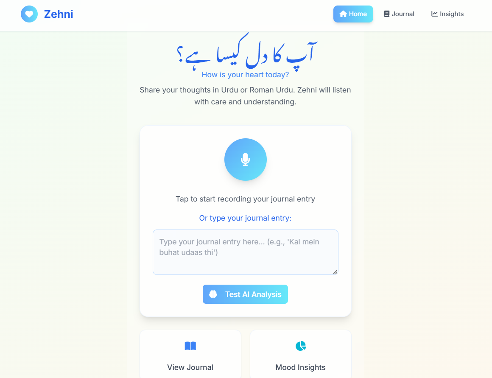
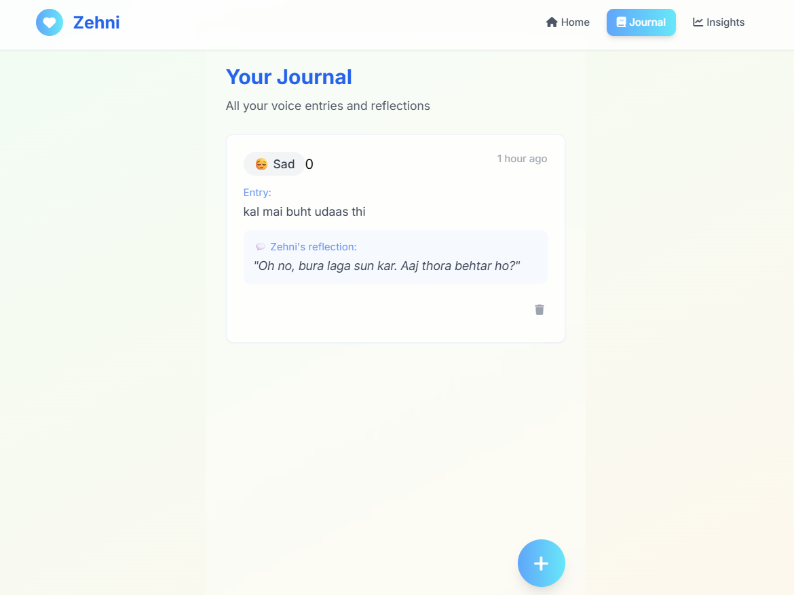
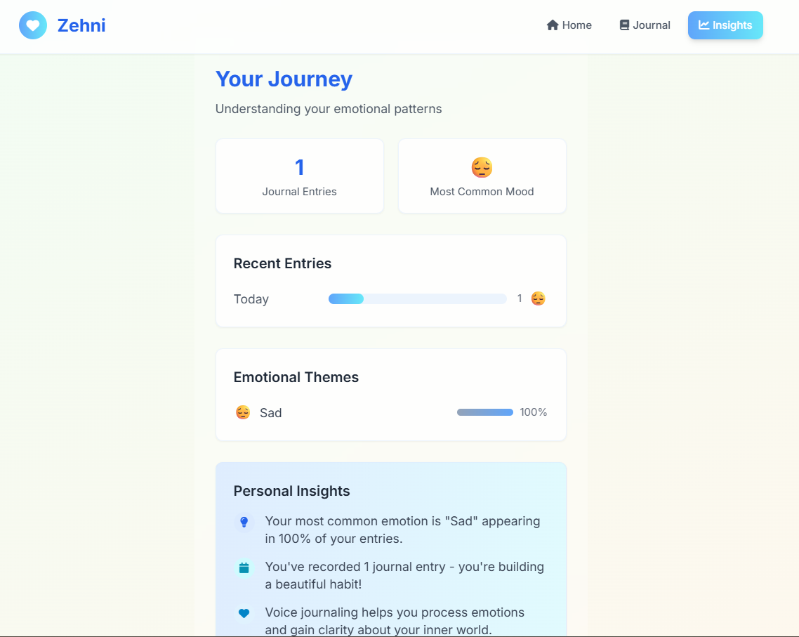

  
# 💬 Zehni – An Urdu Voice Journal for the Soul

  

Zehni is a voice-based journaling app made for Pakistanis to help them process their thoughts. Speak in Urdu, get a summary, a mood label, and an AI-generated message of support – all saved to a beautiful log of emotional moments.

> 🛠️ Built with: Replit + Vite + Express + Drizzle ORM + PostgreSQL + OpenRouter + Web Speech API

---

## 🧠 Why I Made This

I wanted to build something **real**, something that blends **AI** with **mental health**. And I wanted it to **work for Pakistan** — so the voice journaling happens in **Urdu**, the responses feel *relatable*, and everything’s anonymous and low-pressure.

But more than that? I wanted to **ship something**. Something that lives on the internet. Something that feels ✨ personal ✨.

---

## 🗣️ What It Does

1. **Record a voice note** in Urdu using your mic
2. The **Web Speech API** transcribes it live
3. On submit, it sends your entry to `/api/analyze-entry`
4. That endpoint:
   - Summarizes your journal entry
   - Classifies your mood + emoji
   - Generates a sweet response using AI (via OpenRouter)
5. Everything gets saved to the database
6. You can see **all past entries** on a gorgeous log page 💅

---

## 🌍 Cool Detail

All entries are anonymous (and saved under the same test user for now 👀), so it's like a **collective moodboard of what Pakistanis are feeling**. Could be cute. Could be deep. Could be... chaotic. I actually wanted to have it be personal at first, but after running into a million issues with Firebase I gave up and embraced the idea of an anonymous, public diary for Pakistanis.

---

## ⚙️ Tech Stack

| Part              | Tech Used                               |
|-------------------|------------------------------------------|
| Frontend          | Vite + React + Tailwind                  |
| Voice Transcription | Web Speech API                        |
| Backend           | Express + Node.js                        |
| Database          | PostgreSQL + Drizzle ORM                  |
| AI Responses      | OpenRouter API                           |
| Hosting           | Render                                   |
| Dev Platform      | Replit 💻                                 |

---

## 🚧 Limitations / TODOs

- ❌ No auth (everyone sees all entries)  
- 💾 No individual user saving yet  
- 🔒 Everything tied to a single hardcoded test user  
- ✨ Planning to make it multi-user with signups soon!

---

## 📸 Screenshots

---

## 🙏 Shoutout

To **ChatGPT**, for being my co-pilot.  
And to **me**, for debugging through existential dread, database errors, and Replit chaos at 12:39am. 🥲

---

## 💖 Wanna Try It?

https://zehni-ai.onrender.com

---

## 🪄 Fun Fact

I used **Replit** for the full-stack dev and honestly?  
No regrets. No terminal? No problem. Just vibes, `console.log`s, and stubbornness.

---

## ⭐ GitHub Things

If you liked this or think it's cute:

- 🌟 Star the repo  
- 🍴 Fork it  
- 🐞 File issues or PRs  
- 📣 Share with a friend!

---

## 🧵 Want the full dev story?

Check my [LinkedIn post](#) – I talked about the process, breakdowns, breakthroughs, and why I kept going.

